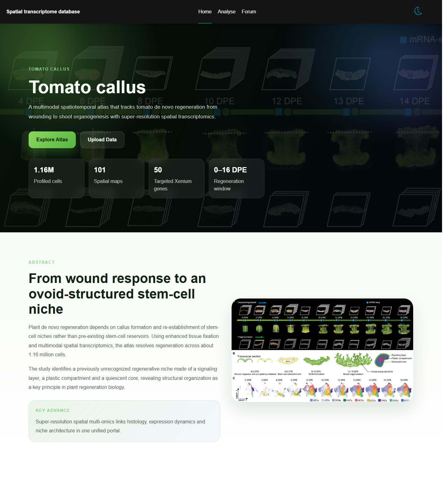
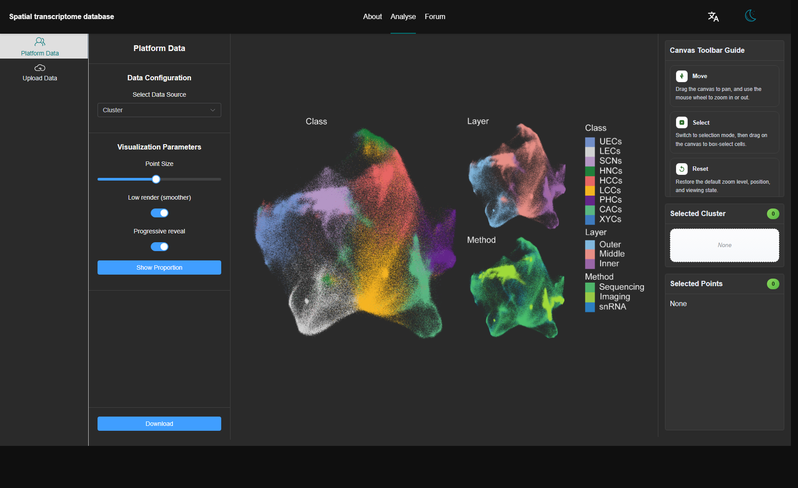
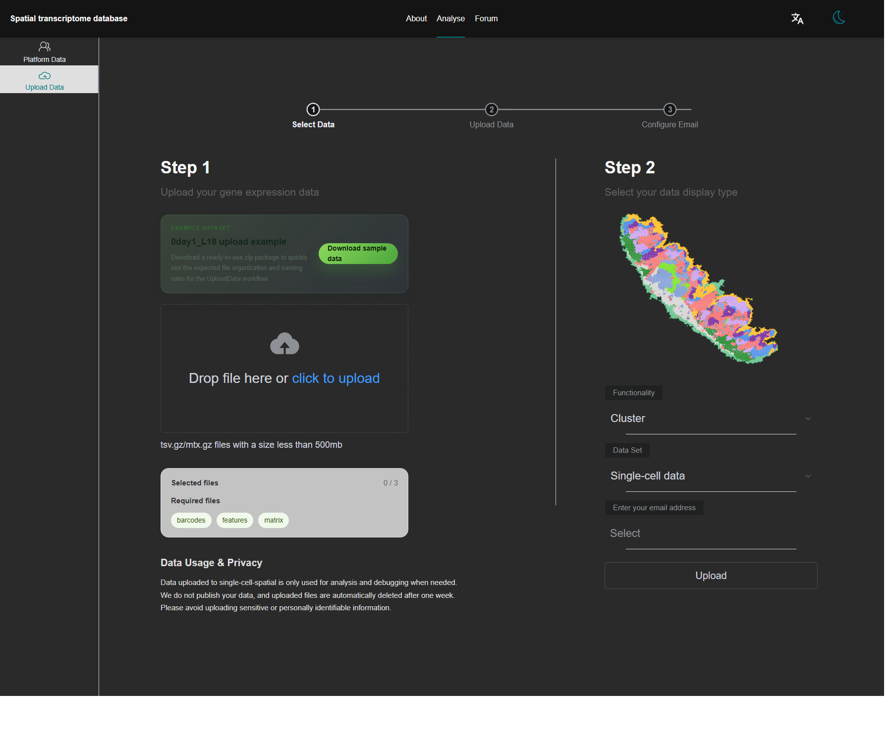
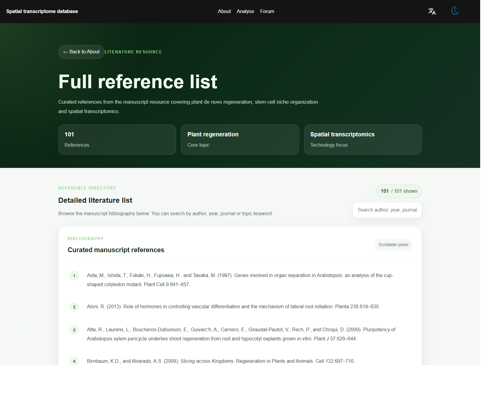

# Tomato callus User Manual

> Purpose: This document helps end users understand and operate the core pages, visualization features, and upload workflow of Tomato callus, a single-cell spatial platform.  
> Last updated: 2026-05-11  
> Screenshot note: All screenshots in this document were captured locally from the current front-end build using Chromium and are stored in the `img/` directory.

---

## 1. Overview

Tomato callus is a single-cell spatial platform for visualization, exploration, and result delivery of spatial transcriptomics, single-cell, and related multimodal datasets from tomato callus regeneration. The website currently includes the following main sections:

- **About**: platform introduction, research background, and resource overview
- **Analyse**: online exploration of built-in datasets with cluster and gene-based visualization
- **Upload Data**: upload user data, configure analysis jobs, and receive results by email
- **References**: browse and search curated literature records
- **Forum**: jump to the external discussion forum

For the best experience, it is recommended to use **Chromium-based browsers** such as Chrome or Edge.

---

## 2. Navigation

### 2.1 Top navigation bar

The top navigation bar provides the following entry points:

- **About**: opens the platform overview page
- **Analyse**: opens the online analysis page
- **Forum**: opens the external forum
- **Language switcher**: supports English and Chinese
- **Theme switcher**: supports light and dark modes

### 2.2 About page

The About page introduces the platform background, study summary, portal modules, and the entry to the reference list.



Recommended usage:

1. Start with the About page to understand the platform context.
2. Click **Explore Atlas** to enter the analysis workspace.
3. Click **Upload Data** to submit your own data.
4. Click **View full reference list** to browse related literature.

---

## 3. Analyse page overview

The Analyse page is the core interactive workspace. It mainly consists of:

1. **Left control panel**: choose data source, data type, analysis mode, and visualization settings
2. **Center canvas area**: display clusters, gene expression, and spatial views
3. **Right info panel**: show tool guidance, selected clusters, selected points, and expression statistics
4. **Top-right legend**: in cluster mode, shows cluster colors and supports color/name editing



---

## 4. Detailed guide to the Analyse page

### 4.1 Left control panel

The left panel is used to configure analysis settings.

#### 4.1.1 Data Configuration

This section controls the data context.

- **Select Data Source**: choose a source such as:
  - `Cluster`
  - `umap`
  - `Xenium`
  - `spatial`
  - `singleCell`
- **Select Data Type**: shown when the source is not `Cluster`, used to select a sample or time point
- **Select Mode**: when supported, switch between:
  - `cluster`
  - `gene`

> Note: in the current logic, the `singleCell` source supports cluster mode only.

#### 4.1.2 Visualization Parameters

This section adjusts the display behavior.

- **Point Size**: control point size
- **Select Clusters**: filter which clusters remain visible under supported sources
- **Show Cluster Labels**: display cluster labels
- **Low render (smoother)**: enable lower-cost rendering for large point sets
- **Progressive reveal**: reveal cluster colors progressively
- **Show Proportion / Hide Proportion**: open or close the proportion chart

#### 4.1.3 Gene Analysis

When the mode is switched to `gene`, the platform supports two gene input styles:

- **Single Gene**: search or enter one gene
- **Gene Set**: enter multiple genes as a multi-line list

Available controls include:

- **Input Gene Name / Input Gene Set**
- **Submit**
- **Show Cluster Background**
- **Show Cluster Labels**
- **Gene Opacity**
- **Gene Color Scale** with Min / Mid / Max colors
- **Cluster Opacity** when background clusters are enabled

#### 4.1.4 Download

The **Download** button at the bottom of the panel exports the current view. Based on the current page logic, the system attempts to preserve the visualization and legend information in the exported result.

---

### 4.2 Canvas area

The canvas is the main visualization region and supports browsing, selecting, and rotating.

#### 4.2.1 Toolbar functions

The canvas toolbar includes:

- **Move**: pan the view and use the mouse wheel to zoom
- **Select**: box-select points or clusters
- **Reset**: restore the default view
- **Rotate Canvas**: rotate the current canvas by the slider

#### 4.2.2 Typical interactions

- Use the mouse wheel to zoom in or out.
- Use **Move** to drag across the canvas.
- Switch to **Select** and drag a rectangle to select cells.
- Use **Reset** after multiple interactions to return to the default view.
- Use the rotation slider when a different orientation makes interpretation easier.

---

### 4.3 Right info panel

The right panel explains and summarizes the current interaction state.

It may include:

- **Canvas Toolbar Guide**
- **Selected Cluster**
- **Selected Points**
- **Gene Expression** statistics when available in gene mode

#### 4.3.1 Selected Cluster

This section shows the currently selected clusters:

- the badge in the title shows the number of selected clusters
- each item displays a color block and the cluster name
- an empty state is shown when nothing is selected

#### 4.3.2 Selected Points

This section shows points selected from the canvas:

- the badge in the title shows the number of selected points
- point names are listed as scrollable cards
- when many items are selected, the list can be scrolled

---

### 4.4 Legend area

In cluster mode, a legend is usually displayed in the upper-right corner.

Supported actions:

- click an item to toggle cluster visibility
- use the color picker to change cluster color
- **double-click a label** to edit the cluster name

This is useful when preparing screenshots or customized exports.

---

## 5. Upload Data page

The Upload Data page is used to submit user datasets and start an analysis workflow.



The page is divided into two columns:

- **Left side**: upload files, review file requirements, and download example data
- **Right side**: choose analysis function, dataset type, and enter an email address
- The top step bar indicates the current stage of the workflow

---

## 6. Upload workflow

### 6.1 Before uploading

Prepare the following in advance:

1. the dataset type you want to analyze
2. the analysis function you want to run
3. files that satisfy the naming rules
4. a valid email address to receive the result package

The page also provides an example package:

- **0day1_L18 upload example**

This sample zip can be downloaded to inspect the expected file organization and naming pattern.

### 6.2 Step-by-step submission

#### Step 1: Upload data files

Drag files into the upload area or click to upload.

#### Step 2: Configure the task

On the right side, complete the following:

- choose **Functionality**
- choose **Data Set**
- enter your email address
- click **Upload** to submit the job

---

## 7. File requirements

The current front-end logic expects the following combinations.

| Function | Data type | Required file count | Required filename keywords | Allowed extensions |
| --- | --- | ---: | --- | --- |
| Cluster analysis | Single-cell data | 3 | `barcodes`, `features`, `matrix` | `.tsv.gz`, `.mtx.gz` |
| Cluster analysis | Single-cell spatial data | 4 | `barcodes`, `features`, `matrix`, `barcodes_pos` | `.tsv.gz`, `.mtx.gz`, `.txt`, `.text` |
| Single-gene mapping | Single-cell data | 4 | `barcodes`, `features`, `matrix`, and one extra gene list file | `.tsv.gz`, `.mtx.gz`, `.txt`, `.text` |
| Single-gene mapping | Single-cell spatial data | 5 | `barcodes`, `features`, `matrix`, `barcodes_pos`, and one extra gene list file | `.tsv.gz`, `.mtx.gz`, `.txt`, `.text` |
| Multi-gene mapping | Single-cell data | 4 | `barcodes`, `features`, `matrix`, and one extra gene list file | `.tsv.gz`, `.mtx.gz`, `.txt`, `.text` |
| Multi-gene mapping | Single-cell spatial data | 5 | `barcodes`, `features`, `matrix`, `barcodes_pos`, and one extra gene list file | `.tsv.gz`, `.mtx.gz`, `.txt`, `.text` |

Additional notes:

- the number of uploaded files must match the expected count exactly
- required keywords must appear in filenames
- gene list files are currently expected to use `.txt` or `.text`
- invalid naming or file counts will trigger front-end validation errors

---

## 8. Email result delivery

The Upload Data page requires an email address. Based on the current system behavior:

- the platform packages generated outputs into a compressed archive
- the email contains a result summary and the archive attachment
- users can directly download the attachment from the email

---

## 9. References page

The References page provides a searchable literature list.



Supported operations:

- view the total number of references
- search by author, year, journal, or keyword
- browse the full scrollable reference list
- return from References to the About page

Typical use cases:

- locating a specific paper quickly
- checking the scientific background of the platform
- using the curated list for reports or supplementary reading

---

## 10. Common usage scenarios

### 10.1 Browse built-in data only

1. Open the About page.
2. Enter Analyse.
3. Choose a data source such as `Cluster`, `umap`, `Xenium`, `spatial`, or `singleCell`.
4. Adjust visualization parameters and inspect the result.
5. Export the current view if needed.

### 10.2 Run a single-gene query

1. Open Analyse.
2. Switch the mode to `gene`.
3. Select **Single Gene**.
4. Enter a gene name and submit.
5. Review the result from the canvas, color bar, and right-side statistics.

### 10.3 Run a multi-gene query

1. Open Analyse.
2. Switch to `gene` mode.
3. Select **Gene Set**.
4. Enter one gene per line.
5. Submit and review the projection output.

### 10.4 Upload your own dataset

1. Download the sample package first.
2. Prepare files using the expected naming rules.
3. Open Upload Data.
4. Upload files and choose function and dataset type.
5. Enter an email address and submit.
6. Wait for the analysis to finish and check your mailbox.

---

## 11. FAQ

### 11.1 Why do I get a file count error during upload?

Because the upload page validates the exact number of files required by the selected function and data type.

### 11.2 Why do I get a filename or file type validation error?

Possible reasons include:

- the extension is not allowed
- the filename does not contain required keywords such as `barcodes`, `features`, `matrix`, or `barcodes_pos`
- the gene list file is not `.txt` or `.text`

### 11.3 Why is there no result in gene mode?

Possible reasons include:

- the selected source does not support gene mode
- the gene name is invalid
- the backend did not return matching data

### 11.4 Why is a Chromium browser recommended?

Because the platform uses modern front-end rendering, interaction, and canvas-based visualization features that are generally more stable in Chrome and Edge.

---

## 12. Directory structure for this manual

```text
PM-System-Beta/
├─ README.md
└─ img/
   ├─ about-page.png
   ├─ platform-page.png
   ├─ upload-page.png
   └─ references-page.png
```

If the UI, button labels, or upload rules change later, this document and the screenshots should be updated together.

---

## 13. Contact

- Website: [Tomato callus](https://www.single-cell-spatial.com/#/home)
- Contact email: `bosheng.li@pku-iaas.edu.cn`

Possible future extensions:

- a Chinese illustrated guide
- an administrator manual
- upload file templates
- a result package content guide
- a troubleshooting-oriented FAQ
